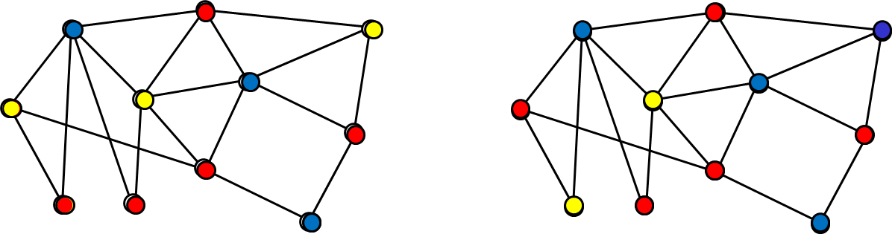

内容項目

1. [ＮＰ問題とは？](#defNP)
2. [ＮＰ問題の代表例](#example)
3. [すみません！間違った印象を与える説明です！](#introduction)
4. [Ｐ≠ＮＰ予想](#conjecture)
5. [Ｐ≠ＮＰ予想の重要性](#importance)
6. [Ｐ≠ＮＰ予想の歴史とこれから](#history)
7. [参考文献](#ref)

## 1. ＮＰ問題とは？  {#defNP}

答えを言われれば「あっ，そうか」と思うけれども，それを見つけるとなると一苦労という問題が，我々の周囲には意外と多くある．

もう少し固くいえば，「解が与えられれば，それが問題の制約を満たしているのは容易に確かめられるが，その解を見つけ出すのが困難」な問題のこと．要するに検算は簡単だが解を求めるのは難しい問題である．

かなり大ざっぱ（で，ちょっと間違っているのだが）**ＮＰ問題**とは， こうした特徴を持つ問題の総称である．

## 2. ＮＰ問題の代表例  {#example}

ＮＰ問題は無数にあるが，その代表例を２つほど紹介しよう． まずは次の問題から．

> **箱詰め問題**
> 
> 
> 
> 与えられた板片を与えられた枠の中に詰め込む方法を求める問題．たとえば，上の図の左のような板を右の枠の中にすべて詰め込む置き方を示せ，という問題である．ちなみに，下図のような詰め込み方が上図の問題例に対する解答（の１つ）である．
> 
> 

この問題は検算が簡単，という性質を持っている． 確かに，詰め方を示されれば， それが問題の条件を満しているかが直ちにわかる． ところが詰め方を見つけ出すのは難しい． 「全部試してみればすむことではないか」 と思われるかもしれない． 板の枚数が少ない場合にはそれでもよいが， 枚数が増えると詰め方が非常に多くなり， 全部を試していたら大変なことになる． たとえば板が 100 枚の場合， スーパーコンピュータを使ったとしても， すべての可能性を調べるのに少なくとも一千万年はかかってしまう．

「全部調べようとするからいけないんだ． もっとよい方法（アルゴリズム）を使えばよい」 という意見もあろう． 確かに工夫次第で 1000 枚ぐらいまでは何とかなるのだが， こうした工夫は本質的な解決ではないので， 板の枚数が 5000 枚くらいになると やはり手に負えなくなってしまう． どうもよい方法がなさそうだ，というのが 「Ｐ≠ＮＰ予想」なのである．

もう一つ例を示そう． 今度は計算機科学の分野でよく出てくるグラフに関する問題である．

> **三彩色問題**
> 
> 
> 
> 与えられたグラフの各頂点を 3 色に塗り分けよ，という問題．ただし，辺で結ばれている 2 頂点を同じ色で塗ってはいけない．たとえば，上の図のようなグラフがその問題例だが，これに対し，下図（右）のように塗るのはダメ．辺の両端が同じ色になっている箇所があるからだ．一方，下図（左）の塗る方は正しい（注：下記）．
> 
> 

この問題の場合も解の検算は比較的簡単だ． （検算のために，すべての辺の両端の色を見るのはちょっとシンドイ， と思われるかもしれないが，コンピュータならば難なくできる．）

注：左図も間違いでした．伊藤隆太郎氏に誤りのご指摘と以下の修正案を頂きました（2015 年 12 月）．ありがとうございました．

## 3. すみません！間違った印象を与える説明です！  {#introduction}
ここまでの説明には，間違った印象を与える点が２点ある． まず，第一に上の２つの例から

*パズルのような問題がＮＰ問題？*

と思われるかもしれない．それは大間違い． 確かに上の２つの例はパズルのようだが， これは現実に解決したい計算問題のエッセンスを説明するために簡略化したため． 我々が処理したい実際問題の中にも（というか，ほとんどの実際問題の中に） ＮＰ問題は登場してくるのである．

もう一つは

*ＮＰ問題の解を求めるのは，すべて難しい？*

と受け取れる説明をしていた点． 本当は，解（候補の）検算が簡単な問題は，すべてＮＰ問題である． 解の計算の難しさはＮＰ問題の定義とは無関係なのだ． つまり，ＮＰ問題の中には，解の検算だけでなく， 解を求めること自体が簡単な問題もある． たとえば，2 色に塗り分ける2 彩色問題は，解の検算が簡単なだけでなく， 解を実際に求めることも可能なのだ． つまり，2 彩色問題はＮＰ問題の中でも簡単（Ｐに入る）問題なのである．

## 4. Ｐ≠ＮＰ予想  {#conjecture}

これまでの説明である程度述べたが，ここで予想について述べておこう．

> **Ｐ≠ＮＰ予想**
> 
> ＮＰ問題と呼ばれる問題群の中には解の計算を「比較的簡単に」行うことのできなような問題が存在する．

ここで「比較的簡単な計算」とはどの程度簡単な計算のか？と思われる人も多いだろう． 正確には「多項式時間計算可能性」（polynomial time computability） という基準を使うのだが， 話が少し技術的になるのでここでは省略する． また「ＮＰ問題は解の検証が比較的簡単な問題」と説明してきたが， この「比較的簡単」の意味も同様である．

ちなみに， 記号Ｐは polynomial-time の頭文字で， 多項式時間計算可能な問題の集合を表わす． 一方，ＮＰは nondeterministic polynomial-time の頭文字で， 解検証が多項式時間計算可能な問題の集合である．

## 5. Ｐ≠ＮＰ予想の重要性  {#importance}

Ｐ≠ＮＰ予想は 計算複雑さの最も重要な予想であり， その解決により， 我々の「計算」に対する理解が大きく進展するだろう． それにより， 数学，いや数理科学に新たな分野が開かれるはずだ． そうした意義もあって， この予想は「２１世紀の７大数学予想」と称されている（クレイ研究所） しかし，さらに言いたい．

**Ｐ≠ＮＰ予想は人類にとって究極的なテーマである！**

人類の営みの中で特徴的なのは「発見」である． 我々は，様々な分野でいろいろな発見を繰り返してきた． そのうち， 発見されてみれば「意外に簡単」と思えるものも少なくない． だからといって 発見の価値が薄れるわけではない． 言われてわかるのと，それを見出すのでは雲泥の差があるからだ．

Ｐ≠ＮＰ予想は， この価値観を数学的に定式化したものなのである． この予想を証明し，理解することで， 我々の価値観に対する，より明確な保証を与えることができるのである．

## 6. Ｐ≠ＮＰ予想の歴史とこれから  {#history}

Ｐ≠ＮＰ予想の歴史はコンピュータの歴史とほぼ同じ， と言ってよいくらい，コンピュータの出現当初からあった． さらに言えば， ゲーデルが晩年のフォン・ノイマンに宛てた手紙の中で， ＮＰ問題の重要性について述べていた，という報告もあるので [1]， 歴史はコンピュータ出現前夜までさかのぼる．

ただし，ゲーデルはＮＰ問題はＰに入ると予想していた節もある． 天才と言えども， 実際にコンピュータが登場する前にそこまで深く見通せなかったのかもしれない．

それで現在どの程度まで研究が進んでいるかというと， かなりいろいろなことがわかっている，ともいえるし， いやいや，まだまだ全然，歯が立たない状況，と言うこともできる．

「かなりわかってきた」というのは 解析の道具や手法が少しずつだが整備されてきたからである． 一方，「歯が立たない」というのは， 解決までの道筋が見えないという点である． 今後は，これまでの道具に磨きをかけるだけでなく， 解決までの道筋を示す「指導原理」の構築が必要となるだろう．

## 7. 参考文献  {#ref}

[1] M. Sipser, The history and status of the P versus NP question, In Proc. ACM STOC, pages, 603-618, 1992.  
[2] 2014 年 3 月に発売した拙著「今度こそわかるＰ≠ＮＰ予想」（講談社）もよろしく．[本の紹介ページ](http://www.is.titech.ac.jp/~watanabe/pnpbook/)もご覧ください．

